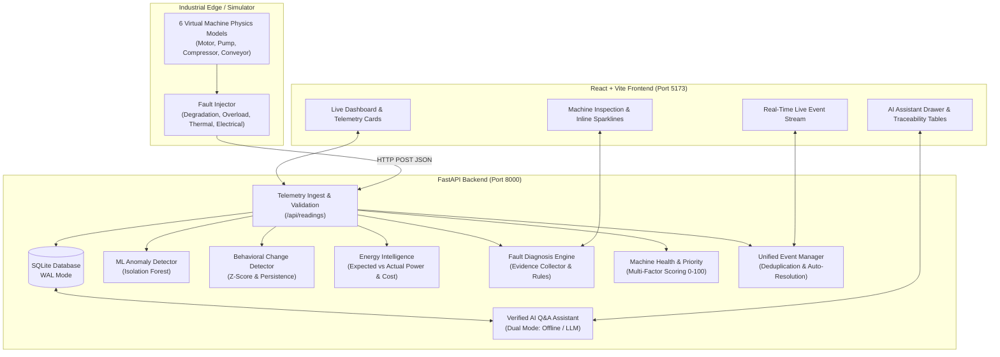

# GridLite: Industrial Edge Intelligence & Predictive Analytics Platform

**GridLite** is a deterministic, evidence-grounded industrial intelligence platform for modern manufacturing and power plants. It transforms high-frequency telemetry streams into prioritized operational actions, energy waste valuations, evidence-backed diagnostic hypotheses, and zero-hallucination conversational intelligence.

---

## 🏭 1. Problem Statement

Industrial operations face major hurdles in plant reliability and energy management:
1. **Alert Fatigue & Duplicate Alarms:** Raw threshold alarms flood operators with thousands of noisy alerts without root-cause context.
2. **Silent Degradation:** Gradual mechanical wear and baseline drift slip past simple threshold bounds until catastrophic failure occurs.
3. **Unmeasured Energy Waste:** Excess power draw and poor power factor waste millions in electricity without clear financial attribution.
4. **Black-Box AI Distrust:** Operators distrust opaque machine learning models that declare faults without explainable, verifiable sensor evidence.
5. **AI Hallucinations:** Generative AI tools often invent telemetry values, dates, and causes, creating dangerous operational liabilities.

---

## ⚡ 2. The GridLite Solution

GridLite solves these challenges with a 10-stage unified intelligence pipeline:
- **Zero-Mock, Real-Time Physics Ingestion:** 6 realistic industrial machines streaming voltage, current, power, temperature, vibration, and power factor.
- **Unsupervised ML Anomaly Detection:** Real-time Isolation Forest detecting multivariate outliers with dynamic anomaly scoring.
- **Persistent Behavioral Drift Tracking:** Rolling-window statistical comparison against learned baselines detecting step changes and gradual trends.
- **Energy Waste & Cost Intelligence:** Physics-derived power baselines computing excess kWh and financial penalties in real-time.
- **Evidence-Based Fault Diagnosis:** Multi-hypothesis diagnostic engine scoring confidence with verifiable sensor evidence and human-in-the-loop review.
- **Factory Health & Investigation Priority:** Multi-signal composite scoring ranking machines in order of operational urgency.
- **Unified Event Pipeline & Smart Deduplication:** Self-healing event lifecycle maintaining single active events and auto-resolving upon telemetry recovery.
- **Verified AI Industrial Assistant:** Dual-mode conversational assistant strictly grounded in database queries with zero hallucination and missing-data refusal.

---

## 📐 3. End-to-End System Architecture



---

## 🛠️ 4. Technology Stack

| Layer | Technologies Used | Key Responsibilities |
| :--- | :--- | :--- |
| **Frontend** | React 18, Vite, Vanilla CSS | Glassmorphism UI, Responsive Grid, SVG Sparklines, Event Stream, Assistant Drawer |
| **Backend** | FastAPI, Python 3.12, Uvicorn | High-throughput async REST API, CORS middleware, Dependency Injection |
| **Database** | SQLite 3, SQLAlchemy ORM | Relational models, WAL mode, foreign key cascades, automatic indexing |
| **Machine Learning** | scikit-learn, NumPy, Joblib | Isolation Forest anomaly detection, StandardScaler normalization, model persistence |
| **Edge Simulator** | Multi-threaded Python, Requests | Thermal dissipation models, mechanical vibration simulation, interactive CLI |
| **AI Layer** | Groq / Google Gemini / Rule Engine | Grounded Q&A, structured evidence tables, verified parameter refusal |

---

## 🚀 5. How to Run the Project

### Prerequisites
- Python 3.10+
- Node.js 18+ and npm

### 1. Start FastAPI Backend
```bash
cd backend
python -m venv venv
.\venv\Scripts\activate
pip install -r requirements.txt
uvicorn app.main:app --host 127.0.0.1 --port 8000 --reload
```
*Backend API docs available at:* `http://127.0.0.1:8000/docs`

### 2. Start React Frontend
```bash
cd frontend
npm install
npm run dev
```
*Dashboard available at:* `http://localhost:5173`

### 3. Start Telemetry Simulator
```bash
cd simulator
..\backend\venv\Scripts\python main.py
```

---

## 🧪 6. Fault Injection & Demonstration Guide

GridLite includes an interactive CLI simulator capable of injecting 4 deterministic industrial fault scenarios:

```text
GridLite Sim> help

Available Commands:
  list                                          - List virtual machines and current status
  inject <machine_id> <fault_type> [severity]   - Inject a realistic fault
  clear <machine_id>                            - Clear active faults and restore baseline
  clear_all                                     - Clear faults across all machines
  reset                                         - Reset all telemetry and fault states
```

### Supported Fault Scenarios

| Scenario | CLI Command | Simulated Physical Symptoms | Downstream Pipeline Reaction |
| :--- | :--- | :--- | :--- |
| **1. Mechanical Degradation** | `inject MOTOR-01 MECHANICAL_DEGRADATION 0.8` | Vibration $\uparrow 0.38$, Power $\uparrow 25\%$, Temp $\uparrow 15\%$ | Anomaly detected $\rightarrow$ Step change in vibration $\rightarrow$ Diagnosis: `MECHANICAL_DEGRADATION` (Score: 0.85) $\rightarrow$ Health: `CRITICAL` $\rightarrow$ Priority #1. |
| **2. High Overload** | `inject PUMP-01 OVERLOAD 0.75` | Current $\uparrow 60\%$, Power $\uparrow 55\%$, Power Factor $\downarrow$ | Excess energy recorded $\rightarrow$ Cost penalty calculated $\rightarrow$ Diagnosis: `OVERLOAD` $\rightarrow$ Priority elevated. |
| **3. Thermal Overheating** | `inject COMPRESSOR-01 OVERHEATING 0.8` | Temperature $\uparrow 78^\circ\text{C}$, thermal dissipation failure | Thermal anomaly flagged $\rightarrow$ Diagnosis: `COOLING_FAILURE_OR_OVERHEATING` $\rightarrow$ Event created. |
| **4. Electrical Anomaly** | `inject CONVEYOR-01 ELECTRICAL_ANOMALY 0.7` | Voltage sag, current spike, Power Factor $\downarrow 0.72$ | Power factor penalty triggered $\rightarrow$ Diagnosis: `ELECTRICAL_ANOMALY_OR_SUPPLY_ISSUE`. |

---

## 🤖 7. Verified AI Industrial Assistant

The GridLite AI Assistant is engineered specifically for industrial reliability:
- **100% Database-Grounded:** Queries SQLite for latest sensor values, baselines, anomalies, behavior changes, energy waste, and priority rankings.
- **Evidence Traceability:** Every response includes structured evidence citations (`Parameter`, `Observed Value`, `Baseline Reference`, `Deviation %`, `Source`).
- **Missing Parameter Refusal:** Asking about unmeasured metrics (e.g. *"What is MOTOR-01's bearing temperature?"*) yields an explicit, professional refusal rather than a hallucinated number.
- **Dual-Mode Architecture:** If an external LLM API key is present (`GROQ_API_KEY` or `GEMINI_API_KEY`), rich industrial explanations are generated; otherwise, the system operates seamlessly in offline deterministic rule-based mode.

---

## 📊 8. API Endpoint Reference

| Category | Method | Endpoint | Description |
| :--- | :--- | :--- | :--- |
| **Machines** | `GET` | `/api/machines` | List all 6 virtual industrial machines |
| **Readings** | `POST` | `/api/readings` | Ingest sensor telemetry with physical validation |
| **Readings** | `GET` | `/api/readings/latest` | Get latest telemetry for all machines |
| **Readings** | `GET` | `/api/machines/{id}/readings` | Historical readings window (default 50) |
| **Anomaly ML** | `POST` | `/api/anomaly/train/{id}` | Train Isolation Forest on historical data |
| **Behavior** | `POST` | `/api/change-detection/analyze/{id}` | Run rolling Z-score baseline comparison |
| **Behavior** | `GET` | `/api/change-detection/baseline/{id}` | Get baseline mean, std, min, max stats |
| **Energy** | `GET` | `/api/energy/overview` | Factory-wide energy waste & cost summary |
| **Energy** | `GET` | `/api/energy/machines/{id}/summary` | Single-machine 24h energy breakdown |
| **Diagnosis** | `POST` | `/api/diagnosis/analyze/{id}` | Run evidence-based fault diagnostic engine |
| **Diagnosis** | `GET` | `/api/diagnosis/overview` | Factory-wide diagnostic overview |
| **Health** | `POST` | `/api/health/analyze/{id}` | Evaluate machine health state & priority score |
| **Health** | `GET` | `/api/health/overview` | Ranked investigation priority list |
| **Events** | `GET` | `/api/events/recent` | Live unified event stream |
| **Events** | `GET` | `/api/events/machines/{id}/timeline` | Machine historical event timeline |
| **Events** | `POST` | `/api/events/{id}/acknowledge` | Operator acknowledges active event |
| **Events** | `POST` | `/api/events/{id}/resolve` | Operator resolves active event |
| **Assistant** | `POST` | `/api/assistant/query` | Submit grounded conversational query |
| **Demo** | `POST` | `/api/demo/reset` | Restore clean demonstration baseline |

---

## 🧪 9. Automated Testing Suite

GridLite includes 8 comprehensive automated test suites covering all 11 phases:

```bash
cd backend
python -m unittest tests_master_integration.py   # Master end-to-end integration tests (7 tests)
python -m unittest tests_pipeline.py             # Telemetry & event pipeline tests (20 tests)
python -m unittest tests_assistant.py            # AI assistant grounding & refusal tests (20 tests)
python -m unittest tests_health.py               # Machine health & priority ranking tests (10 tests)
python -m unittest tests_diagnosis.py            # Fault diagnosis & evidence tests (11 tests)
python -m unittest tests_energy.py               # Energy intelligence & cost tests (8 tests)
python -m unittest tests_change.py               # Behavioral change detection tests (14 tests)
python -m unittest tests_ml.py                   # Isolation Forest ML tests (10 tests)
python -m unittest tests_db.py                   # Database persistence tests (6 tests)
```
*Total Backend Tests:* **106 tests, 100% passing.**

---

## 🔮 10. Limitations & Production Deployment Roadmap

### Current Scope & Boundaries
- **Edge Deployment Simulation:** Machine sensors are simulated with high-fidelity physical formulas rather than physical RS485/Modbus hardware.
- **Embedded Database:** SQLite with WAL mode is optimal for single-node industrial edge appliances; multi-plant enterprise analytics benefit from distributed time-series storage.

### Production Roadmap
1. **Hardware Ingestion Connectors:** Direct OPC-UA, MQTT-Sparkplug B, and Modbus TCP edge collectors.
2. **Distributed Time-Series Backend:** TimescaleDB or InfluxDB for multi-year historical telemetry storage.
3. **Edge Containerization:** Docker Compose and K3s manifests for deployment on industrial gateway IPCs (e.g. Advantech, Siemens IPC).
4. **Enterprise RBAC & Audit Trails:** Multi-tenant plant segregation, LDAP/Active Directory integration, and 21 CFR Part 11 compliant audit logging.
